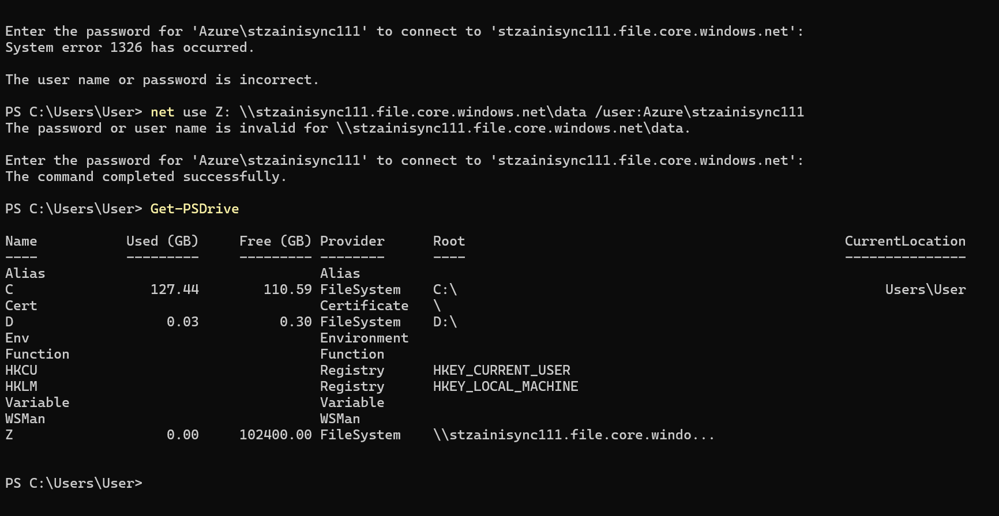

🗂️ AZ-104 Lab – Azure Files UNC Mount (SMB Access)

Exam: Microsoft AZ-104 – Azure Administrator
Focus: Azure Files SMB access using UNC paths, authentication, and PowerShell mapping

🧠 Objective

Demonstrate how to access an Azure File Share using a UNC path and SMB authentication, as tested in AZ-104 exam questions (e.g. Question 112).

This lab validates:

Correct UNC path format

Authentication method for Azure Files

PowerShell drive mapping behavior

Common errors and how to fix them

🧪 Scenario Overview

You have:

One Azure subscription

One Azure Storage Account

One Azure File Share named data

You need to:

Access the file share from Windows

Use the correct UNC path

Authenticate successfully using Storage Account credentials

🛠️ Azure Resources Used

Azure Storage Account (Standard, LRS)

Azure File Share

Windows 10 / Windows Server

PowerShell

📁 Repository Structure
azure-files-unc-mount-lab/
│
├── README.md
├── screenshots/
│   ├── azure-files-file-explorer-mount.png
│   └── azure-files-powershell-mount.png
│
├── scripts/
│   ├── mount-azure-files.ps1
│   └── unmount-azure-files.ps1
│
└── exam-notes/
    └── question-112.md

🔹 Step 1 – Create Azure File Share

In the Azure Portal:

Go to Storage account

Navigate to File shares

Create a file share named:

data

✔ This folder must exist before mounting

🔹 Step 2 – Identify the Correct UNC Path

Azure Files uses the following format:

\\<storage-account-name>.file.core.windows.net\<file-share-name>

Example:
\\stzainisync111.file.core.windows.net\data

🚫 Common mistakes:

Using blob.core.windows.net

Including subscription name

Using portal.azure.com

🔹 Step 3 – Authenticate Using Correct Credentials

Azure Files does NOT use:

Local Windows users

Azure VM users

Entra ID (unless identity-based access is configured)

✅ Correct Authentication
Field	Value
Username	Azure\<storage-account-name>
Password	Storage Account Access Key

📍 Access key location:

Storage Account → Access keys → Key1 or Key2

🔹 Step 4 – Mount Using File Explorer (GUI)

Open File Explorer

Enter the UNC path:

\\stzainisync111.file.core.windows.net\data

When prompted:

Username: Azure\stzainisync111

Password: Storage account access key

### Azure Files Access via File Explorer (UNC)

🔹 Step 5 – Mount Using PowerShell (Exam-Relevant)

Run PowerShell as Administrator:

net use Z: \\stzainisync111.file.core.windows.net\data /user:Azure\stzainisync111

Enter the storage account access key when prompted.

Verify mapping:

Get-PSDrive

### PowerShell SMB Mount (net use)

🔹 Step 6 – Common Error & Fix (System Error 1326)
❌ Error:
System error 1326
The user name or password is incorrect

✅ Fix checklist:

Username format must be:

Azure\<storage-account-name>

Password must be:

Storage account Access Key

Ensure the file share exists

Remove cached credentials if needed:

net use * /delete

📝 AZ-104 Exam Takeaways (Question 112)

Azure Files UNC path uses:

file.core.windows.net

Authentication uses:

Azure\<storage-account-name>

Password = Storage account key

Azure Files ≠ Azure Blob

UNC access works over SMB (port 445)

🎯 Skills Demonstrated

Azure Storage Accounts

Azure Files (SMB)

UNC path construction

PowerShell drive mapping

Authentication troubleshooting

AZ-104 exam readiness

🔗 Related Labs

Azure File Sync Constraints Lab
👉 (Separate repo focused on sync groups & endpoints)
